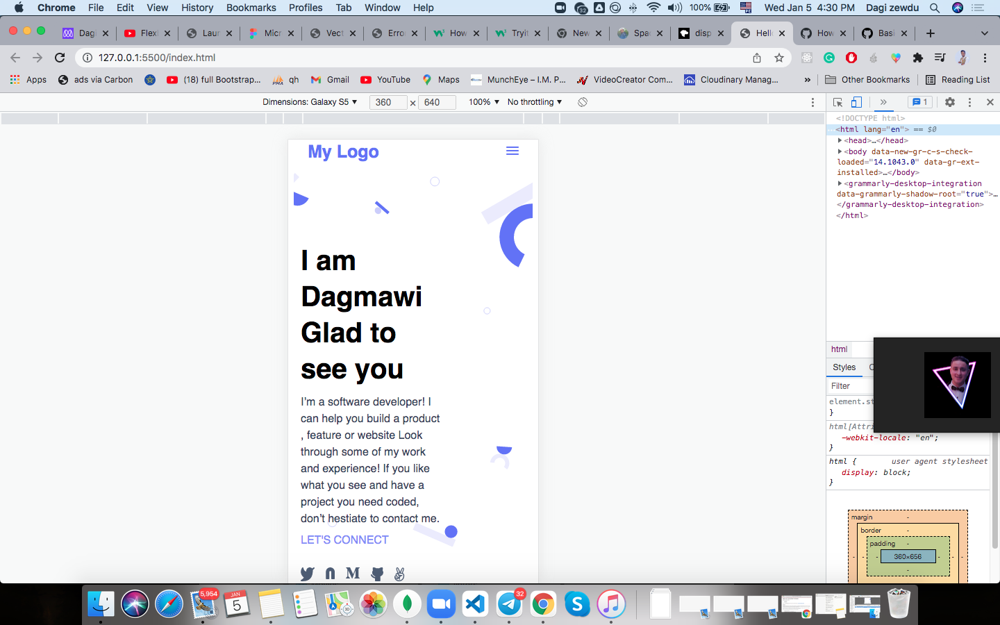

# Portfolio: setup and mobile version skeleton

> This is a Portfolio: setup and mobile version skeleton excercise.



My goal here is to master all of the tools and best practices learned in previous microverse exercise like github flow and linters.

## Built With

- Lighthouse (An open-source, automated tool for improving the quality of web pages. It has audits for performance, accessibility, progressive web apps, SEO and more).
- Webhint (A customizable linting tool that helps you improve your site's accessibility, speed, cross-browser compatibility, and more by checking your code for best practices and common errors).
- Stylelint (A mighty, modern linter that helps you avoid errors and enforce conventions in your styles).

To get a local copy up and running follow these simple example steps.

### Prerequisites
The basic requirements for building the executable are:

* VSCode or any other equivalent code editor
* node package manager

# Getting Started

#### Cloning the project
```
git clone  https://github.com/Dagic-zewdu/Portfolio-setup--and-mobile-version-skeleton
```

## Getting packages and debuging with Stylelint
```
npm install --save-dev stylelint@13.x stylelint-scss@3.x stylelint-config-standard@21.x stylelint-csstree-validator@1.x
```
##### For validation detection using Stylelint Run
```
npx stylelint "**/*.{css,scss}"
```
##### from parent source directory

## Getting packages and debuging with Webhint
```
npm init -y
npm install --save-dev hint@6.x
```
##### For validation detection using Webhint Run
```
npx hint .
```
##### from parent source directory

### Licence
Copyright (c) <year> <copyright holders>

This software is provided 'Dagic', without any express or implied warranty. In no event will the authors be held liable for any damages arising from the use of this software.

Permission is granted to anyone to use this software for any purpose, including commercial applications, and to alter it and redistribute it freely, subject to the following restrictions:


## Author
 **Dagmawi zewdu Tilahun** - [Dagic-zewdu](https://github.com/Dagic-zewdu)